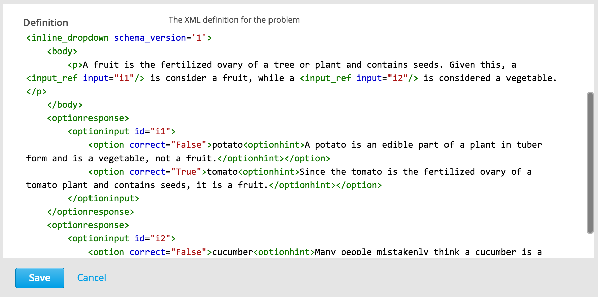

Inline Dropdown XBlock
=========================
This XBlock provides a way to place dropdown questions inline with other text, for example, in a paragraph.  


Installation
------------
To install the Inline Dropdown XBlock within your edX python environment, simply run this command:

```bash
$ pip install -r requirements.txt
```

Enabling in Studio
------------------
Go to `Settings -> Advanced Settings` and set `Advanced Module List` to `["inline-dropdown"]`.


Usage
------------------
Once the Inline Dropdown XBlock is enabled in Studio, you should see a new Component button labeled `Advanced`:


Click the `Advanced` button and you should see the Inline Dropdown XBlock listed:


After you've selected the Inline Dropdown XBlock, a default question will be inserted into your unit:


Customization
-------------
The question can be customized by clicking the `Edit` button on the component:




The Inline Dropdown XBlock uses a simple XML-based structure as shown below:
```bash
<inline_dropdown schema_version='1'>
    <body>
        <p>A fruit is the fertilized ovary of a tree or plant and contains seeds. Given this, a <input_ref input="i1"/> is consider a fruit, while a <input_ref input="i2"/> is considered a vegetable.</p>
    </body>
    <optionresponse>
       	<optioninput id="i1">
       		<option correct="True">tomato<optionhint>Since the tomato is the fertilized ovary of a tomato plant and contains seeds, it is a fruit.</optionhint></option>
       		<option correct="False">potato<optionhint>A potato is an edible part of a plant in tuber form and is a vegetable, not a fruit.</optionhint></option>
       	</optioninput>
    </optionresponse>
    <optionresponse>
       	<optioninput id="i2">
       		<option correct="False">cucumber<optionhint>Many people mistakenly think a cucumber is a vegetable. However, because a cucumber is the fertilized ovary of a cucumber plant and contains seeds, it is a fruit.</optionhint></option>
       		<option correct="True">onion<optionhint>The onion is the bulb of the onion plant and contains no seeds and is therefore a vegetable.</optionhint></option>
       	</optioninput>
    </optionresponse>
    <demandhint>
        <hint>A fruit is the fertilized ovary from a flower.</hint>
        <hint>A fruit contains seeds of the plant.</hint>
    </demandhint>
</inline_dropdown>
```

README for Inline Dropdown Problem XBlock


Testing with Docker
====================

This XBlock comes with a Docker test environment ready to build, based on the xblock-sdk workbench. To build and run it::

    $ make dev.run

The XBlock SDK Workbench, including this XBlock, will be available on the list of XBlocks at http://localhost:8000

Translating
=============

Internationalization (i18n) is when a program is made aware of multiple languages.
Localization (l10n) is adapting a program to local language and cultural habits.

Use the locale directory to provide internationalized strings for your XBlock project.
For more information on how to enable translations, visit the
`Open edX XBlock tutorial on Internationalization <http://edx.readthedocs.org/projects/xblock-tutorial/en/latest/edx_platform/edx_lms.html>`_.

This cookiecutter template uses `django-statici18n <https://django-statici18n.readthedocs.io/en/latest/>`_
to provide translations to static javascript using ``gettext``.

The included Makefile contains targets for extracting, compiling and validating translatable strings.
The general steps to provide multilingual messages for a Python program (or an XBlock) are:

1. Mark translatable strings.
2. Run i18n tools to create raw message catalogs.
3. Create language specific translations for each message in the catalogs.
4. Use ``gettext`` to translate strings.

1. Mark translatable strings
-----------------------------

Mark translatable strings in python::


    from django.utils.translation import ugettext as _

    # Translators: This comment will appear in the `.po` file.
    message = _("This will be marked.")

See `edx-developer-guide <https://edx.readthedocs.io/projects/edx-developer-guide/en/latest/internationalization/i18n.html#python-source-code>`_
for more information.

You can also use ``gettext`` to mark strings in javascript::


    // Translators: This comment will appear in the `.po` file.
    var message = gettext("Custom message.");

See `edx-developer-guide <https://edx.readthedocs.io/projects/edx-developer-guide/en/latest/internationalization/i18n.html#javascript-files>`_
for more information.

2. Run i18n tools to create Raw message catalogs
-------------------------------------------------

This cookiecutter template offers multiple make targets which are shortcuts to
use `edx-i18n-tools <https://github.com/edx/i18n-tools>`_.

After marking strings as translatable we have to create the raw message catalogs.
These catalogs are created in ``.po`` files. For more information see
`GNU PO file documentation <https://www.gnu.org/software/gettext/manual/html_node/PO-Files.html>`_.
These catalogs can be created by running::


    $ make extract_translations

The previous command will create the necessary ``.po`` files under
``xblock-inline-dropdow/inline_dropdown/locale/en/LC_MESSAGES/text.po``.
The ``text.po`` file is created from the ``django-partial.po`` file created by
``django-admin makemessages`` (`makemessages documentation <https://docs.djangoproject.com/en/1.11/topics/i18n/translation/#message-files>`_),
this is why you will not see a ``django-partial.po`` file.

3. Create language specific translations
----------------------------------------------

3.1 Add translated strings
***************************

After creating the raw message catalogs, all translations should be filled out by the translator.
One or more translators must edit the entries created in the message catalog, i.e. the ``.po`` file(s).
The format of each entry is as follows::

    #  translator-comments
    A. extracted-comments
    #: reference…
    #, flag…
    #| msgid previous-untranslated-string
    msgid 'untranslated message'
    msgstr 'mensaje traducido (translated message)'

For more information see
`GNU PO file documentation <https://www.gnu.org/software/gettext/manual/html_node/PO-Files.html>`_.

To use translations from transifex use the follow Make target to pull translations::

    $ make pull_translations

See `config instructions <https://github.com/edx/i18n-tools#transifex-commands>`_ for information on how to set up your
transifex credentials.

See `transifex documentation <https://docs.transifex.com/integrations/django>`_ for more details about integrating
django with transiflex.

3.2 Compile translations
*************************

Once translations are in place, use the following Make target to compile the translation catalogs ``.po`` into
``.mo`` message files::

    $ make compile_translations

The previous command will compile ``.po`` files using
``django-admin compilemessages`` (`compilemessages documentation <https://docs.djangoproject.com/en/1.11/topics/i18n/translation/#compiling-message-files>`_).
After compiling the ``.po`` file(s), ``django-statici18n`` is used to create language specific catalogs. See
``django-statici18n`` `documentation <https://django-statici18n.readthedocs.io/en/latest/>`_ for more information.

To upload translations to transiflex use the follow Make target::

    $ make push_translations

See `config instructions <https://github.com/edx/i18n-tools#transifex-commands>`_ for information on how to set up your
transifex credentials.

See `transifex documentation <https://docs.transifex.com/integrations/django>`_ for more details about integrating
django with transiflex.

 **Note:** The ``dev.run`` make target will automatically compile any translations.

 **Note:** To check if the source translation files (``.po``) are up-to-date run::

     $ make detect_changed_source_translations

4. Use ``gettext`` to translate strings
----------------------------------------

Django will automatically use ``gettext`` and the compiled translations to translate strings.

Troubleshooting
================

If there are any errors compiling ``.po`` files run the following command to validate your ``.po`` files::

    $ make validate

See `django's i18n troubleshooting documentation
<https://docs.djangoproject.com/en/1.11/topics/i18n/translation/#troubleshooting-ugettext-incorrectly-detects-python-format-in-strings-with-percent-signs>`_
for more information.
